_[Click here to open documentation in english | Pulse aquí para abrir documentación en inglés](README.md)_

---
Aplicación para personalizar y lanzar fácilmente un servidor de Killing Floor 2 a través de una interfaz visual en lugar de editar ficheros batch o de configuración del servidor. Ha sido desarrollado en Java y la interfaz es compatible con los S.O. Windows y Linux.

*Ejemplo de configuración*

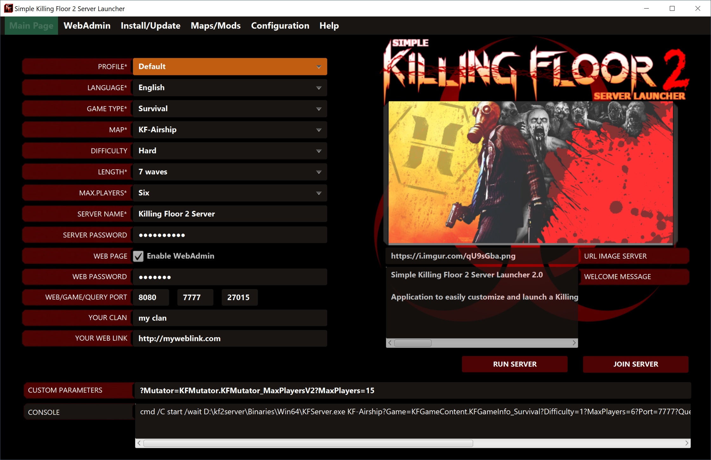

*Resultado después de unirse al servidor mediante el cliente de juego*

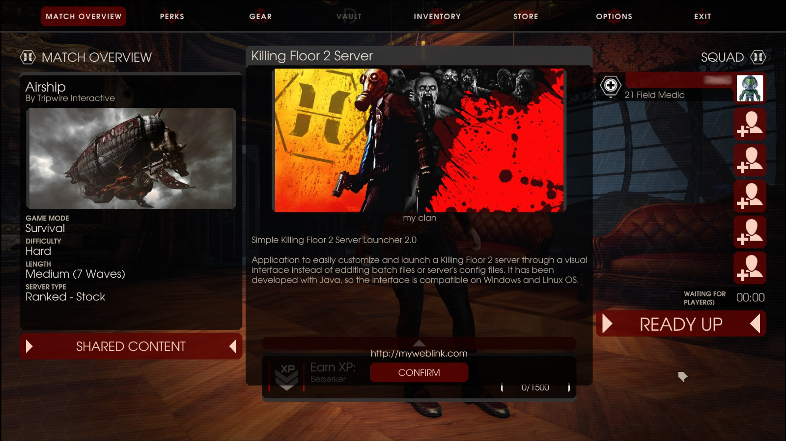

### Índice
> 1. [Caracteristicas](#caracteristicas)
> 2. [Pre-requisitos](#pre-requisitos)
> 3. [Instalar y ejecutar el lanzador](#instalar-y-ejecutar-el-lanzador)
>   - [En Windows](#en-windows)
>   - [En Linux](#en-linux)
> 4. [Vista rapida](#vista-rapida)
>   - [Pagina principal](#pagina-principal)
>   - [Pagina WebAdmin](#pagina-webadmin)
>   - [Pagina instalar o actualizar](#pagina-instalar-o-actualizar)
>   - [Pagina mapas y mods](#pagina-mapas-y-mods)
>   - [Configuracion-Perfiles](#configuracion-perfiles)
>   - [Configuracion-Tipos de juegos](#configuracion-tipos-de-juegos)
>   - [Configuracion-Dificultades](#configuracion-dificultades)
>   - [Configuracion-Longitudes](#configuracion-longitudes)
>   - [Configuracion-Maximo jugadores](#configuracion-maximo-jugadores)
> 5. [Parametros por consola](#parametros-por-consola)
> 6. [Donacion](#donacion)

## Caracteristicas

```
Versión: 2.0.2 final
S.O. soportados: Microsoft Windows y Linux (Ubuntu/Debian)
Autor: César Rodríguez González
Idiomas: Inglés, Español, Francés
Traducción a francés por: -foG.Nox
```

- Instalar/actualizar el servidor a la última versión oficial o beta. 
- Lanzar el servidor con los parámetros especificados por el usuario en la página principal del lanzador.
- Unirse a la partida en curso del servidor.
- Abrir la página WebAdmin para administrar el servidor en ejecución.
- Añadir mapas personalizados y mods al servidor mediante el WorkShop de Steam.
- Eliminar mapas personalizados y mods del servidor.
- Administrar perfiles, tipos de juegos, dificultades, longitudes y máximo número de jugadores que pueden ser seleccionados para lanzar el servidor.
- Importar mapas oficiales, mapas personalizados y mods del servidor al lanzador.
- Importar perfiles de fichero al lanzador.
- Exportar perfiles del lanzador a fichero.
- Lanzar el servidor a través de consola sin necesidad de interación con la interfaz.
- Todas estas características están disponibles a través de la interfaz del lanzador en Windows y Linux.

## Pre-requisitos
- Conexión a internet para descargar, actualizar y publicar un servidor de Killing Floor 2.
- Abrir los puertos necesarios en el router y firewall si quieres que el servidor sea visible en internet.

  | Puerto      | Por defecto | Protocolo  | Qué controla esta opción                                                                  |
  |-------------|-------------|------------|-------------------------------------------------------------------------------------------|
  | Game Port   | 7777        | UDP        | Este es el puerto principal por donde envía conexiones el juego                           |
  | Query Port  | 27015       | UDP        | Este es el puerto usado para comunicarse con el Servidor Maestro de Steam                 |
  | Web Admin   | 8080        | TCP        | Este puerto se usa para conectarse a la página WebAdmin del servidor (si fué habilitada)  |
  | Steam Port  | 20560       | UDP        |                                                                                           |
  | NTP Port    | 123         | UDP        | Semanal solamente - Usado para determinar el evento semanal correctamente                 |

- Instalar Oracle JRE 8 (Java Runtime Environment) para poder ejecutar el lanzador. JRE puede ser descargado de [aquí](https://www.java.com/es/download/).

## Instalar y ejecutar el lanzador
- Descargar la última versión del programa desde [aquí](https://github.com/cesar-rgon/simple-kf2-server-launcher/releases)
- Extraer el contenido del fichero zip a una carpeta local.

##### En Windows
- Ejecuta el fichero "SimpleKF2ServerLauncher.jar" haciendo doble click sobre el fichero, como método alternativo, escribe los siguientes comandos en una terminal.  

*Ejemplo*
```
C:\> cd SimpleKF2ServerLauncher-local-folder
C:\SimpleKF2ServerLauncher-local-folder> java -jar SimpleKF2ServerLauncher.jar
```
*NOTA: Reemplaza SimpleKF2ServerLauncher-local-folder por la carpeta local que quieras.*

##### En Linux
- Ejecuta el fichero "SimpleKF2ServerLauncher.jar" con los siguientes comandos en una terminal:

*Ejemplo*
```
$ cd SimpleKF2ServerLauncher-local-folder
$ java -jar SimpleKF2ServerLauncher.jar
```
*NOTA: Reemplaza SimpleKF2ServerLauncher-local-folder por la carpeta local que quieras.*

*NOTA: JRE debe ser la versión de Oracle (no OpenJDK disponible en los repositorios).*

## Vista rapida

#### Pagina principal
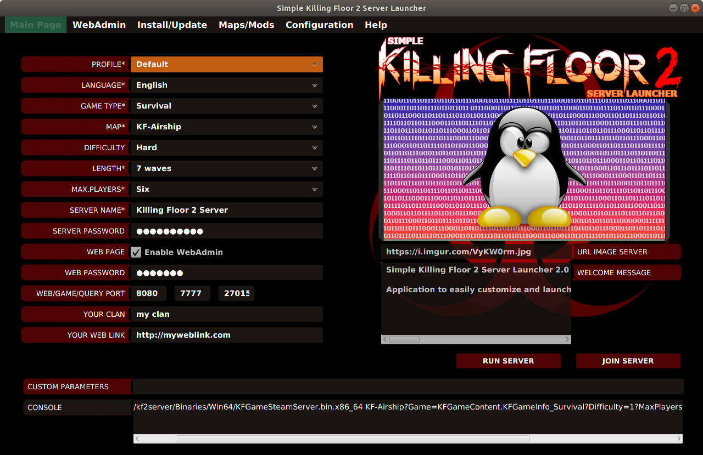

* _Perfil_: Este combo es obligatorio. Permite personalizar los valores de los filtros por nombre de perfil.
 
* _Idioma_: Este combo es obligatorio. Permite seleccionar un idioma para la interfaz del lanzador. La lista de idiomas disponibles están en el apartado [Caracteristicas](#caracteristicas) de este documento.

* _Tipo de juego_: Este combo es obligatorio. Permite seleccionar un tipo de juego específico.

* _Mapa_: Este combo es obligatorio. Permite seleccionar un mapa oficial o personalizado específico. *NOTA: Los mapas personalizados son visibles en este campo sólamente si han sido descargados previamente.*

* _Dificultad_: Este combo es obligatorio. Permite seleccionar un nivel de dificultad específico.

* _Longitud_: Este combo es obligatorio. Permite seleccionar un número específico de oleadas.

* _Máx. jugadores_: Este combo es obligatorio. Permite seleccionar un número máximo de jugadores específico en la partida.

* _Nombre de servidor_: Este campo es obligatorio. Debe contener al menos un caracter. 

* _Contraseña de servidor_: Este campo es opcional. Permite proteger tu servidor con una contraseña (se necesita conocer para poder unirse al juego).

* _Página web_: Si el check de página web está activo, puedes gestionar el servidor mediante la página WebAdmin. El servidor de Killing Floor 2 debe haberse lanzado previamente a acceder a la página de WebAdmin.

* _Contraseña web_: Este campo es opcional. Permite proteger la página de WebAdmin con una contraseña para autenticarse.

* _Puertos_: Los puertos son opcionales. Necesitas abrir los puertos en tu router y firewall. Si se lanza más de un servidor, los puertos deben ser diferentes entre ellos (una configuración por perfil).

* _Tu clan_: Este campo es opcional.

* _Tu página web_: Este campo es opcional.

* _URL imágen servidor_: Este campo es opcional. Este enlace debe corresponder a una imagen subida a internet que será usada como imágen de bienvenida en el servidor de Killing Floor 2. El formato y resolución debe ser PNG 512x256 píxeles.

* _Mensaje de bienvenida_: Este campo es opcional. Es un mensaje de bienvenida en la pantalla iniciar del servidor.

* _Parámetros personalizados_: Este campo es opcional. Define parámetros adicionales. El formato debe ser: [?]parametro1=valor1?parametror2=valor2?...?parametroN=valorN

  [?] significa: opcionalmente puedes comenzar los parámetros por "?"

* _Consola_: Este campo es rellenado automáticamente cuando se ejecuta el servidor. Está compuesto por comandos de consola necesarios para ejecutar el servidor.

* _Ejecutar servidor_: Ejecuta un servidor Killing Floor 2 con los filtros especificados. Todos los filtros obligatorios deben ser especificados. Los ficheros de configuración del servidor están ubicados en la carpeta: KFGame/Config/NOMBREPERFIL. De esta manera, los ficheros de configuración originales localizados en la carpeta: KFGame/Config nunca son modificados.
Si hay más de un perfil definido, puedes lanzar múltiples servidores a la vez (uno por perfil). 

* _Unirse al servidor_: Unirse a un servidor de Killing Floor 2 previamente iniciado. Si el servidor no ha sido iniciado, la operación iniciará el juego pero no se unirá a ningún servidor. Pre-requisitos: Deben estar instaladas las aplicaciones: Steam y cliente (juego) Killing Floor 2. 
Si hay más de un perfil definido, puedes seleccionar a qué servidor quieres unirte (uno por perfil).

#### Pagina WebAdmin
En esta sección puedes acceder a la página WebAdmin sólamente si el servidor ya está iniciado y la página web está activa en la sección "Página Principal" de la aplicación.
WebAdmin te permite gestionar y controlar el servidor de Killing Floor 2.

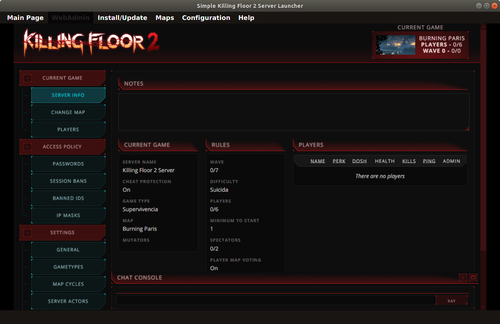

#### Pagina instalar o actualizar
En esta sección puedes instalar o actualizar el servidor de Killing Floor 2.

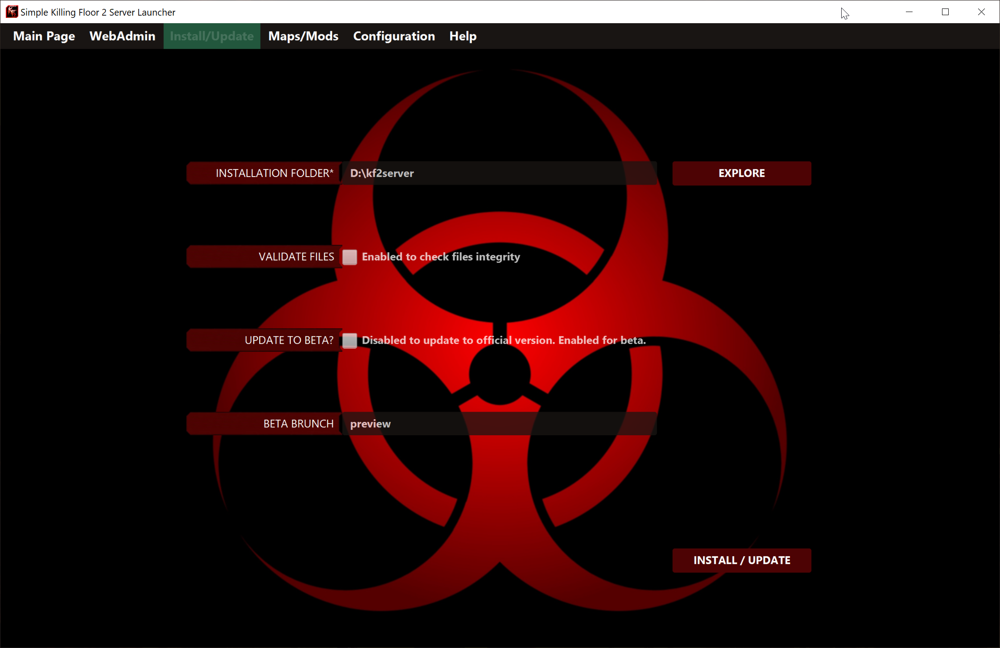

* _Carpeta de instalación_: Este campo es obligatorio. Necesario para encontrar la carpeta local donde el servidor debe ser instalado.

* _Validar ficheros_: Este campo es opcional. Si está activado, la operación de instalar/actualizar revisa la integridad de los ficheros del servidor. Es una operación lenta.

* _¿Actualizar a beta?_: Este campo es opcional. Si está activado, la operación actualiza a una versión beta del juego (si estuviera disponible).

* _Rama beta_: Este campo es opcional. El usuario especifica el nombre de la rama beta (sólamente usado cuando el check anterior ha sido activado).

#### Pagina Mapas y Mods
En esta sección puedes gestionar mapas personalizados, mods y mapas oficiales presentes en el servidor.

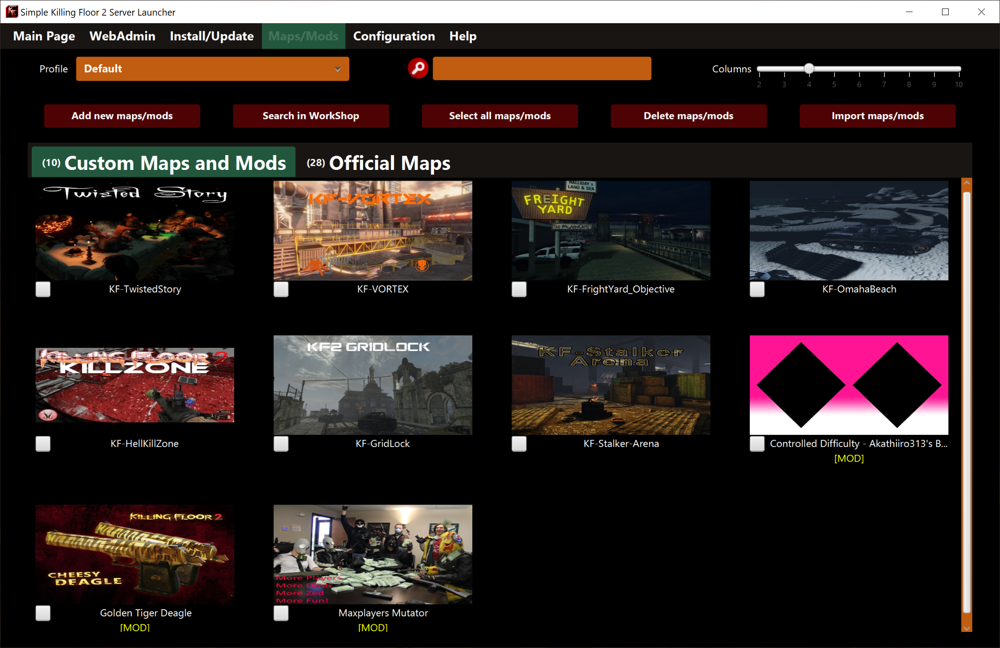

* _Buscador_: Filtro para buscar mapas y mods por nombre mientras vas escribiendo el texto. 

* _Columnas_: Barra deslizante que permite cambiar el tamaño de las miniaturas de los mapas según un número de columnas determinado. 

* _Añadir nuevos mapas/mods_: Permite añadir nuevos mapas personalizados y mods desde el WorkShop de Steam mediante id de WorkShop o URL. Si hay más de un elemento, usa comas como separador. 
 
* _Selecciona todos los mapas/mods_: Permite seleccionar o deseleccionar todos los mapas personalizados y mods así como los mapas oficiales.

* _Elimina mapas/mods_: Permite eliminar todos los mapas y mods previamente seleccionados.

* _Importa mapas/mods_: Permite importar todos los mapas personalizados, mods y mapas oficiales del servidor al lanzador. Sólamente los elementos que no está aún presentes en el lanzador.

* _Buscar en WorkShop_: Permite navegar en las páginas de WorkShop buscando nuevos mapas y mods. Luego puedes seleccionar cuál de ellos añadir al lanzador.

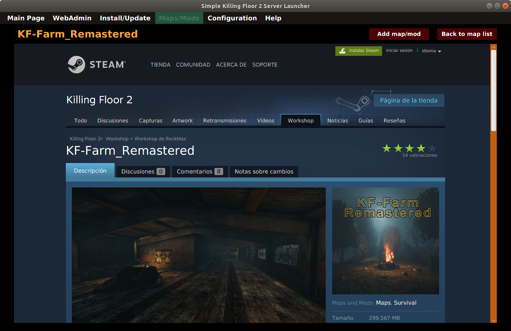

#### Configuracion-Perfiles
En esta sección puedes gestionar perfiles desde el lanzador. Cada perfil es usado para personalizar tus parámetros del servidor.

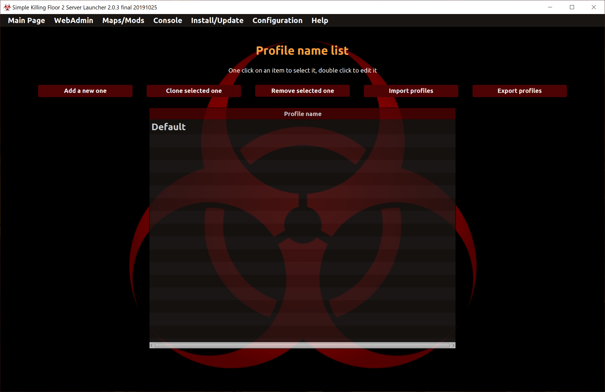

* _Doble click en un nombre de perfil_: Permite editar el nombre de perfil.
* Añadir nuevo perfil_: Permite añadir un nuevo perfil. El nombre debe ser único.
* _Clonar el perfil seleccionado_: Permite duplicar el perfil seleccionado a un nuevo perfil.
* _Eliminar perfil seleccionado_: Permite eliminar el perfil seleccionado.
* _Import profiles_: Permite importar perfiles desde fichero al lanzador.
* _Exportar perfiles_: Permite exportar perfiles desde el lanzador a un fichero.

**NOTA**: No se permite duplicación de nombre de perfil en ninguna de las operaciones.

#### Configuracion-Tipos de juegos
En esta sección puedes añadir, editar o eliminar tipos de juegos del lanzador. Cada tipo de juego está compuesto por cuatro campos:
1. _Código_: Código para identificar el tipo de juego. No es un texto libre, debe ser exactamente como es descrito en la documentación del servidor de Killing Floor 2. 
2. _Descripción_: Texto libre para identificar el tipo de juego.
3. _Dificultades activas_: Indica si el combo de dificultades está activo o no.
4. _Longitudes activas_: Indica si el combo de longitudes está activo o no.

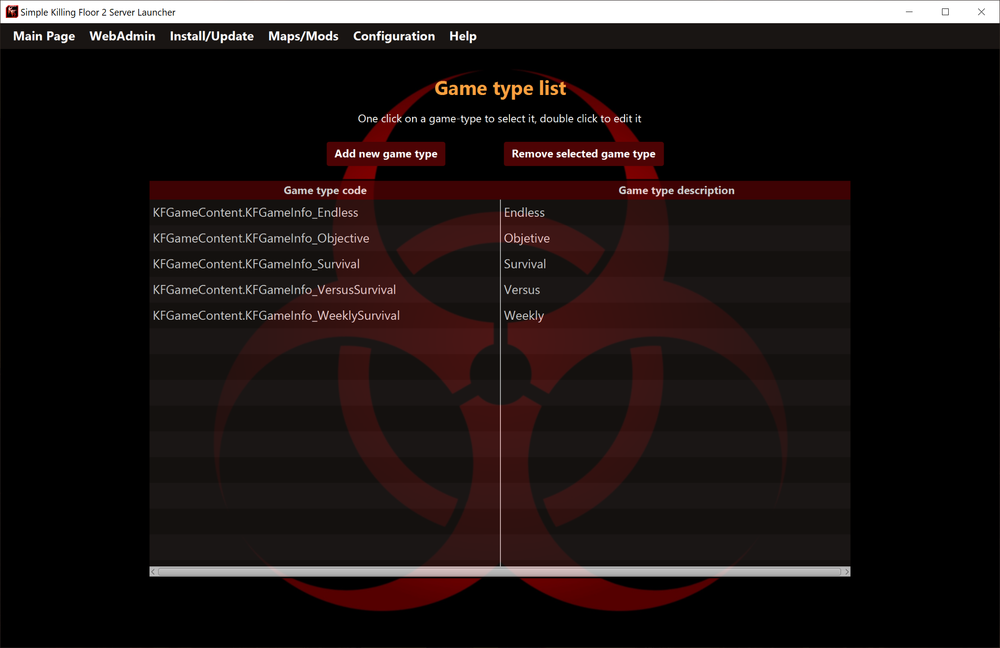

* _Añadir nuevo tipo de juego_: Permite añadir un nuevo tipo de juego sin duplicidad de código.
* _Doble click en un código o descripción de tipo de juego_: Permite editar el campo.
* _Eliminar el tipo de juego seleccionado_: Permite eliminar el código y descripción del tipo de juego seleccionado.

#### Configuracion-Dificultades
En esta sección puedes añadir, editar o eliminar dificultades del lanzador. Cada dificultad está compuesta por dos campos:
1. _Código_: Código para identificar el tipo de dificultad. No es un texto libre, debe ser exactamente como es descrito en la documentación del servidor de Killing Floor 2. 
2. _Descripción_: Texto libre para identificar el tipo de dificultad. 

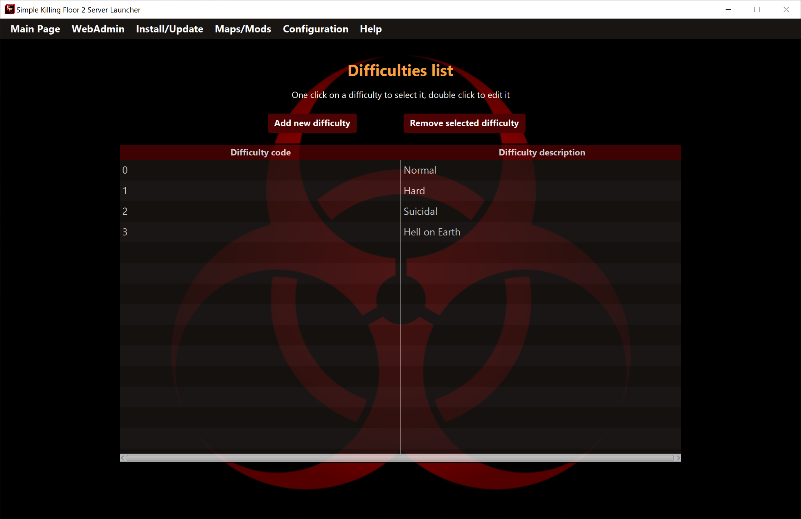

* _Añadir nueva dificultad_: Permite añadir una nueva dificultad sin duplicidad de código.
* _Doble click en un código o descripción de dificultad_: Permite editar el campo.
* _Eliminar la dificultad seleccionada_: Permite eliminar el código y descripción de la dificultad seleccionada.

#### Configuracion-Longitudes
En esta sección puedes añadir, editar o eliminar longitudes del lanzador. Cada longitud está compuesta por dos campos:
1. _Código_: Código para identificar el tipo de longitud. No es un texto libre, debe ser exactamente como es descrito en la documentación del servidor de Killing Floor 2. 
2. _Descripción_: Texto libre para identificar el tipo de longitud. 

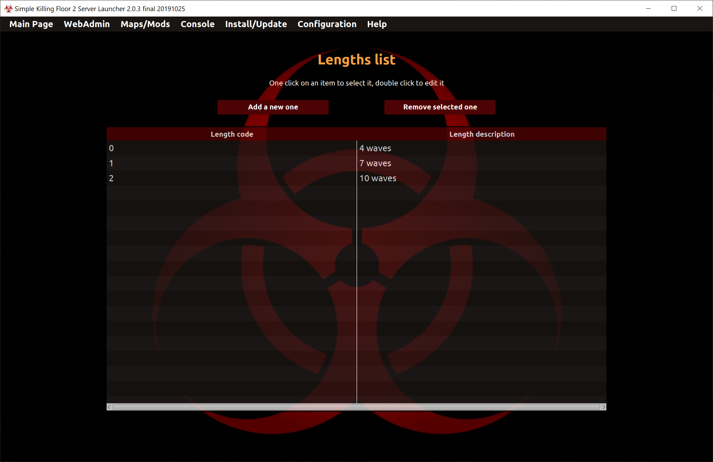

* _Añadir nueva longitud_: Permite añadir una nueva longitud sin duplicidad de código.
* _Doble click en un código o descripción de longitud_: Permite editar el campo.
* _Eliminar la longitud seleccionada_: Permite eliminar el código y descripción de la longitud seleccionada.

#### Configuracion-Maximo jugadores
En esta sección puedes añadir, editar o eliminar el máx.jugadores del lanzador. Cada número máx. jugadores está compuesto por dos campos:
1. _Código_: Código para identificar el máx.jugadores. No es un texto libre, debe ser exactamente como es descrito en la documentación del servidor de Killing Floor 2. 
2. _Descripción_: Texto libre para identificar el máx.jugadores.

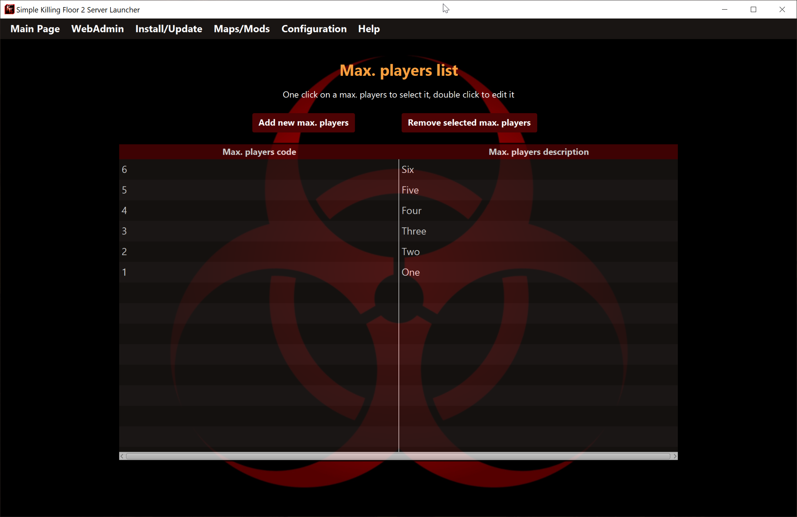

* _Añadir nuevo número de máx.jugadores_: Permite añadir un nuevo número de máx.jugadores sin duplicidad de código.
* _Doble click en un código o descripción de máx.jugadores_: Permite editar el campo.
* _Eliminar el máx.jugadores seleccionado_: Permite eliminar el código y descripción del máx.jugadores seleccionado.

## Parametros por consola
El lanzador permite ejecutar servidores a través de parámetros de terminal sin interacción del usuario con la interfaz.

Los parámetros aceptados son: *Por ejemplo*:

```
java -jar SimpleKF2ServerLauncher.jar --profiles nombrePerfil1 [nombrePerfil2 nombrePerfil3 ... ]
```
*NOTE: [ ] significa que estos parámetros son opcionales*

- Este comando ejecuta uno o varios servidores, uno por nombre de perfil.
- Los nombres de perfiles deben estar separados por espacio en blanco.
- Los nombres de perfiles deben existir en la base de datos del lanzador.

## Donacion
Si encontraste útil esta aplicación, te gustó y quieres contribuir, puedes donar la cantidad que estimes [aquí](https://www.paypal.me/cesarrgon).


¡Muchas gracias!
