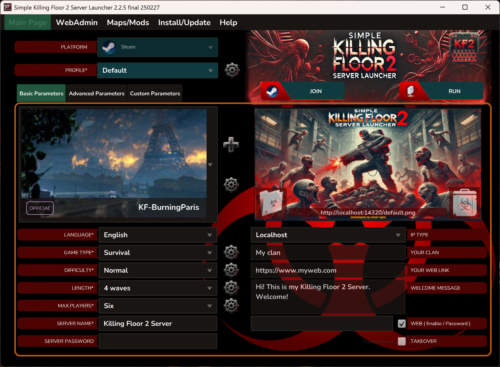
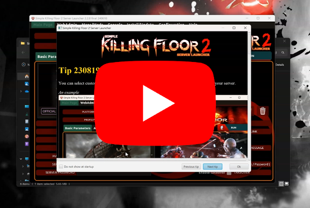
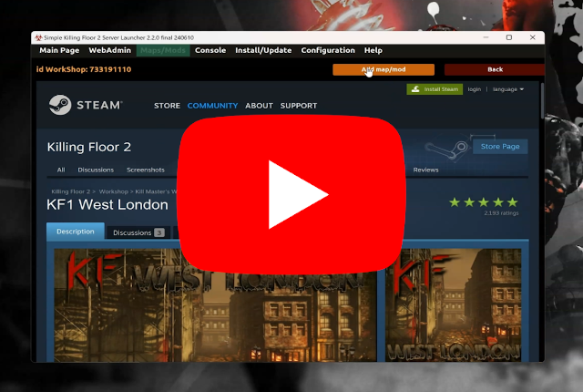
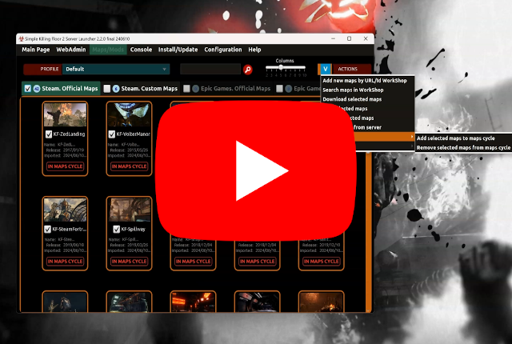
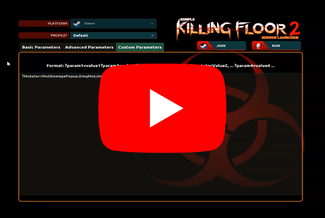
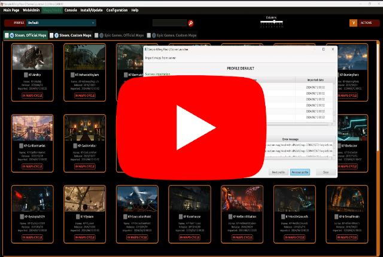
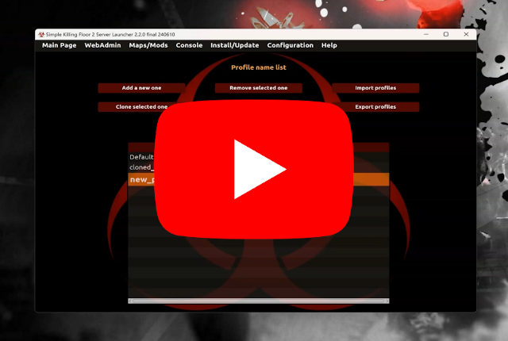

_[Click here to open documentation in english | Pulse aquí para abrir documentación en inglés](README.md)_

---
Aplicación para personalizar y lanzar fácilmente un servidor de Killing Floor 2 a través de una interfaz visual en lugar de editar ficheros batch o de configuración del servidor. Ha sido desarrollado en Java y la interfaz es compatible con los S.O. Windows y Linux.

```
Versión: 2.2.5 final
S.O. soportados: Microsoft Windows y Linux (Ubuntu/Debian)
Plataformas soportadas: Steam y Epic Games
Desarrollado por: César Rodríguez González
Idiomas: Inglés, Español, Francés, Ruso
Traducción a inglés y español: César Rodríguez González
Traducción a francés por: -foG.Nox
Traducción a ruso por: Dreadmor404
```
**Servidor Discord: https://discord.gg/WdwRU522Fb**

*Ejemplo de configuración*



*Resultado después de unirse al servidor mediante el cliente de juego*


## Características

- Instalar/actualizar el servidor a la última versión oficial o beta.
- Las plataformas soportadas son: Steam y Epic Games.
- Lanzar el servidor con los parámetros especificados por el usuario en la página principal del lanzador.
- Unirse a la partida en curso del servidor.
- Abrir la página WebAdmin para administrar el servidor en ejecución.
- Añadir mapas personalizados y mods al servidor mediante el WorkShop de Steam.
- Eliminar mapas personalizados y mods del servidor.
- Administrar perfiles, tipos de juegos, dificultades, longitudes y máximo número de jugadores que pueden ser seleccionados para lanzar el servidor.
- Importar mapas oficiales, mapas personalizados y mods del servidor al lanzador.
- Importar perfiles de fichero al lanzador.
- Exportar perfiles del lanzador a fichero.
- Lanzar el servidor a través de consola sin necesidad de interación con la interfaz.
- Asistente para configurar fácilmente un servidor de KF2.
- Todas estas características están disponibles a través de la interfaz del lanzador en Windows y Linux.

## Pre-requisitos

Mira la documentación de esta sección [aquí](doc/es/PRE-REQUISITOS.md).

[](https://www.youtube.com/watch?v=hTaJCDZ3ahQ)


## Instalar y ejecutar el lanzador

Mira la documentación de esta sección [aquí](doc/es/INSTALAR-LANZADOR.md).

[](https://www.youtube.com/watch?v=ew7t6XHTFOg)


## Instalar y ejecutar el servidor de Killing Floor 2

Mira la documentación de esta sección [aquí](doc/es/INSTALAR-SERVIDOR.md).

[](https://www.youtube.com/watch?v=s41C-PLWcQI)


## Configuración básica

Mira la documentación de esta sección [aquí](doc/es/CONFIGURACION-BASICA.md).

[](https://www.youtube.com/watch?v=FFKeWvROfmo)


## Mapas personalizados y mods

Mira la documentación de esta sección [aquí](doc/es/MAPAS-PERSONALIZADOS.md).

### Añadir mapas

[](https://www.youtube.com/watch?v=kUKtUBQkYX0)

### Gestionar ciclo de mapas

[](https://www.youtube.com/watch?v=K7_IrQxcWgQ)

### Añadir mutadores

[](https://www.youtube.com/watch?v=knku3crQW7s)

### Gestionar mapas

[](https://www.youtube.com/watch?v=zk7BFij-jEs)

### Importar mapas del servidor

[](https://www.youtube.com/watch?v=Oh5q5XVlGDk)


## Configuracion avanzada

Mira la documentación de esta sección [aquí](doc/es/CONFIGURACION-AVANZADA.md).

### Gestionar perfiles

[](https://www.youtube.com/watch?v=hif6yBDUfzE)

### Gestionar tipos de juego

Ejemplo: Este video muestra cómo añadir y configurar el mod Zedternal Reborn al lanzador. 

Para ello se necesitan nuevos modos de juego.

[](https://www.youtube.com/watch?v=emb2y1rN3iE)


## Anexo
- [Ejecutar un fichero antes de lanzar el servidor](doc/es/ANEXO.md#ejecutar-un-fichero-antes-de-lanzar-el-servidor)
- [Parametros por consola](doc/es/ANEXO.md#parametros-por-consola)

## Donación
Si encontraste útil esta aplicación, te gustó y quieres contribuir, puedes donar la cantidad que estimes [aquí](https://www.paypal.me/cesarrgon).


¡Muchas gracias!
