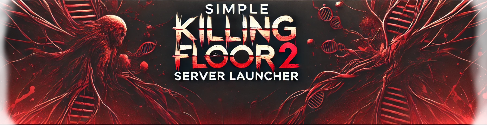
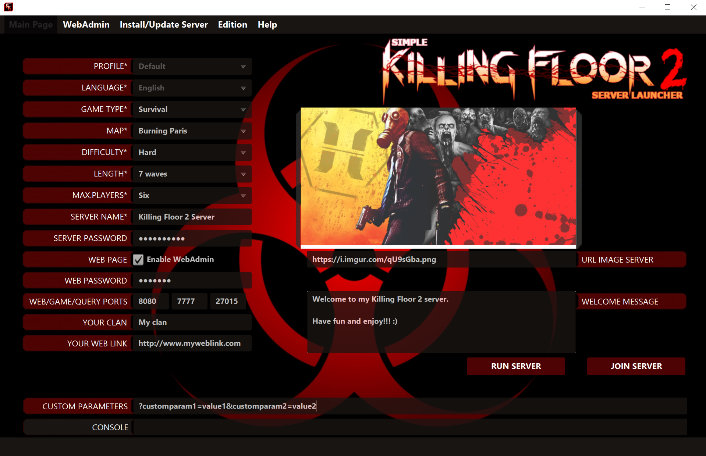

Application to easily customize and launch a Killing Floor 2 Server through a visual interface instead of edditing batch files or server's config files. It has been developed with Java, so the interface is compatible on Windows and Linux OS.

```
Version: 2.0 alpha
Last modification date: 2019/06/20
Supported OS: Microsoft Windows and Linux
Author: César Rodríguez González
Language: English (Spanish soon)
```

**Full documentation and binary files will be available soon.**




