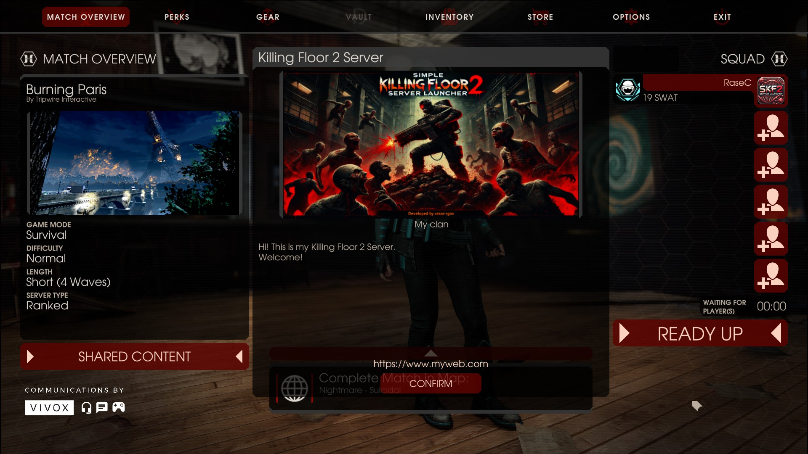

_[Click here to open documentation in spanish | Pulse aquí para abrir documentación en español](LEEME.md)_

---
Application to easily customize and launch a Killing Floor 2 server through a visual interface instead of edditing batch files or server's config files. It has been developed with Java, so the interface is compatible on Windows and Linux OS.

```
Version: 2.1.4 alpha
Supported OS: Microsoft Windows and Linux (Ubuntu/Debian)
Supported platforms: Steam and Epic Games
Developed by: César Rodríguez González
Languages: English, Spanish, French, Russian
Translation to english and spanish: César Rodríguez González
Translation to french by: -foG.Nox
Translation to russian by: Medarel Moore
```
**Discord server: https://discord.gg/WdwRU522Fb**

*Example of configuration*


*Result after join the server through the game's client*



## Features

- Install/Update server to the latest official or beta version.
- Supported platforms are: Steam and Epic Games.
- Launch the server with specified parameters by the user in launcher's main page.
- Join the running server's match.
- Open WebAdmin page to administrate the running server.
- Add custom maps and mods to the server through Steam's WorkShop.
- Remove custom maps and mods from the server.
- Administrate profiles, game types, difficulties, lengths and maximum number of players that can be selected to launch the server.
- Import official maps, custom maps and mods from the server to the launcher.
- Import profiles from file to the launcher.
- Export profiles from the launcher to file.
- Launch the server through console with no need of interaction with the interface.
- All those features are available through the launcher's interface on Windows and Linux OS.

## Pre-requisites
See documentation about this section [here](doc/PRE-REQUISITES.md).

## Install and run the launcher

[](https://www.youtube.com/watch?v=1fAL5AK55QY)

See documentation about this section [here](doc/INSTALL-LAUNCHER.md).

## Install the server

[](https://www.youtube.com/watch?v=JYf4dvg04nc)

See documentation about this section [here](doc/INSTALL-SERVER.md).

## Basic configuration

[](https://www.youtube.com/watch?v=2qVCiDyYjdw)

See documentation about this section [here](doc/BASIC-CONFIGURATION.md).

## Custom maps and mods

[](https://www.youtube.com/watch?v=Y94hFK6jOEI)

See documentation about this section [here](doc/CUSTOM-MAPS.md).

## Advanced configuration

[](https://www.youtube.com/watch?v=tFxy_neabug)

See documentation about this section [here](doc/ADVANCED-CONFIGURATION.md).

## Annex
- [Execute a file before launch the server](doc/ANNEX.md#execute-a-file-before-launch-the-server)
- [Console parameters](doc/ANNEX.md#console-parameters)

## Donation
If you find useful this application, you liked it and you want to contribute, you can donate the amount you desire [here](https://www.paypal.me/cesarrgon).


Thank you very much!
