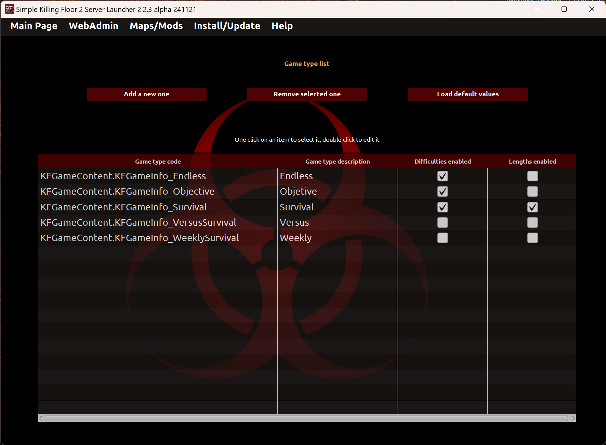
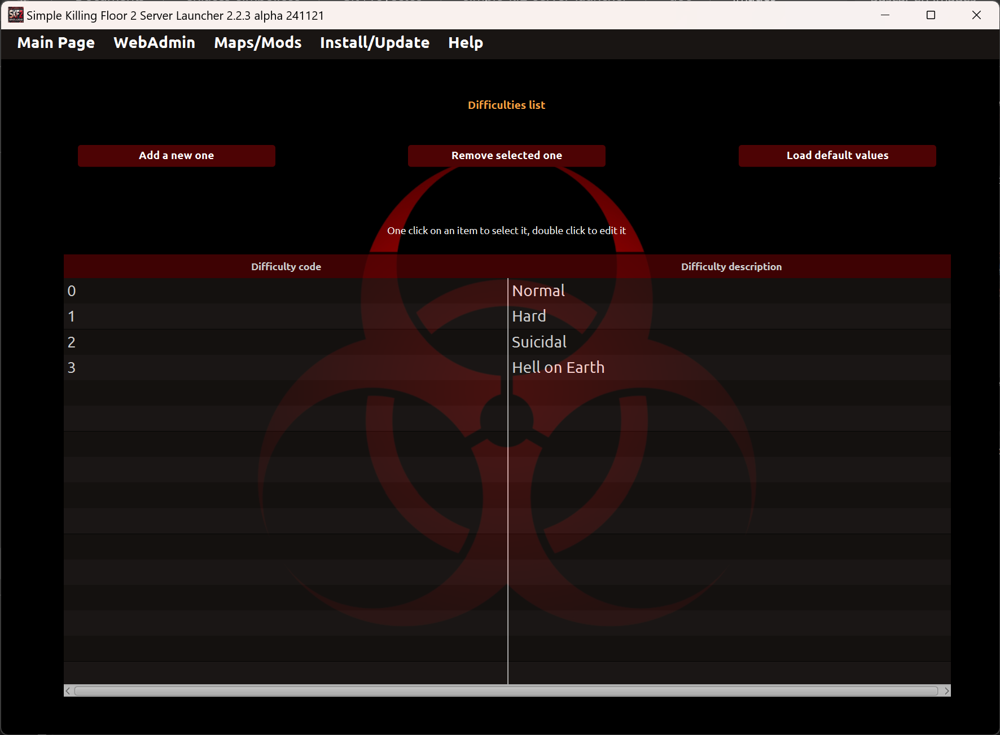
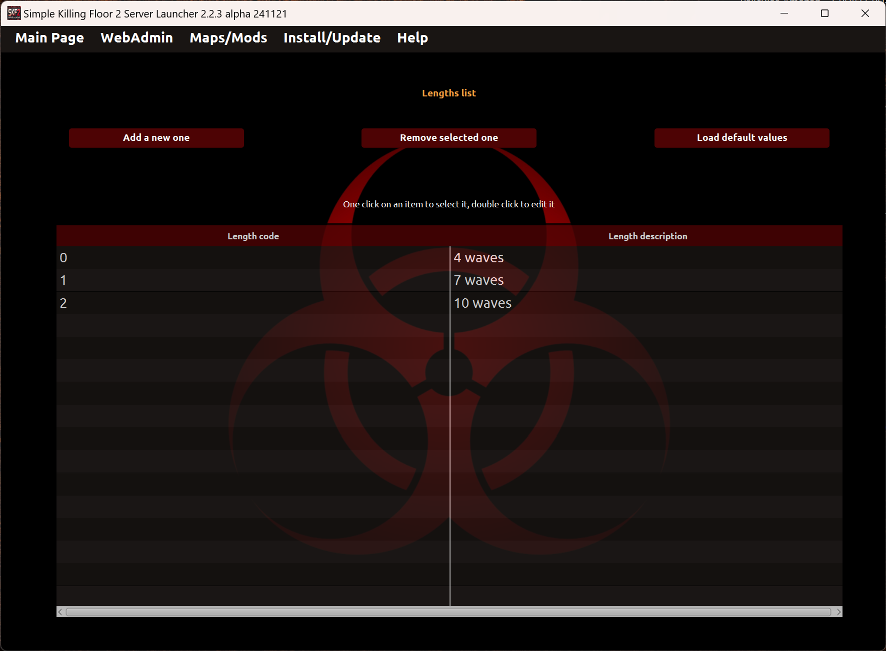

# Advanced configuration

## Profile list
In this section you can manage profiles from the launcher. Each profile is used to customize your server parameters.

* _Double click on a profile name_: It allows to edit the profile name.
* _Add new profile_: It allows to add a new profile. The profile name must be unique.
* _Clone selected profile_: It allows to duplicate the selected profile to a new profile.
* _Remove selected profile_: It allows to remove the selected profile.
* _Import profiles_: It allows to import profiles from a file to the launcher.
* _Export profiles_: It allows to export profiles from the launcher to a file.
* _Load default values_: It allows to delete all profiles and load default profile.

**NOTE**: No profile name duplication accepted in any operation.

## Game type list
In this section you can add, edit or remove game types from the launcher. Each game type is composed by four fields:
1. _Code_: Code to identify the game type mode. It's not a free text, it has to be exactly like described in the Killing Floor 2 server documentation.
2. _Description_: Free text to identify the game type mode.
3. _Difficulties enabled_: If difficulties combo is active or not.
4. _Lengths enabled_: If lengths combo is active or not.
5. _Load default values_: It allows to delete all gametypes and load default gametypes.

* _Add new game type_: It allows to add a new game type with no code duplicated.
* _Double click on a game type code or description_: It allows to edit the field.
* _Remove selected game type_: It allows to remove the selected game type code and description.

## Difficulty list
In this section you can add, edit or remove difficulties from the launcher. Each difficulty is composed by two fields:
1. _Code_: Code to identify the difficulty mode. It's not a free text, it has to be exactly like described in the Killing Floor 2 server documentation.
2. _Description_: Free text to identify the difficulty mode.
3. _Load default values_: It allows to delete all difficulties and load default difficulties.

* _Add new difficulty_: It allows to add a new difficulty with no code duplicated.
* _Double click on a difficulty code or description_: It allows to edit the field.
* _Remove selected difficulty_: It allows to remove the selected difficulty code and description.

## Length list
In this section you can add, edit or remove length modes from the launcher. Each length is composed by two fields:
1. _Code_: Code to identify the length mode. It's not a free text, it has to be exactly like described in the Killing Floor 2 server documentation.
2. _Description_: Free text to identify the length mode.
3. _Load default values_: It allows to delete all lengths and load default lengths.

* _Add new length_: It allows to add a new length with no code duplicated.
* _Double click on a length code or description_: It allows to edit the field.
* _Remove selected length_: It allows to remove the selected length code and description.

## Maximum players list
In this section you can add, edit or remove the max.players from the launcher. Each max.players is composed by two fields:
1. _Code_: Code to identify the max.players. It's not a free text, it has to be exactly like described in the Killing Floor 2 server documentation.
2. _Description_: Free text to identify the max.players.
3. _Load default values_: It allows to delete all maxplayers and load default maxplayers.

* _Add new max.players_: It allows to add a new max.players with no code duplicated.
* _Double click on a max.players code or description_: It allows to edit the field.
* _Remove selected max.players_: It allows to remove the selected max.players code and description.

---
Back to main page [here](../README.md).