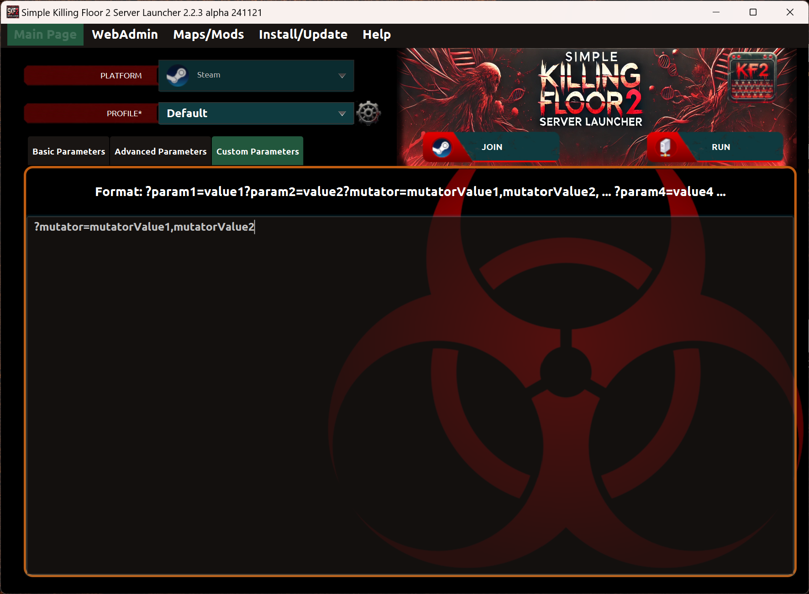
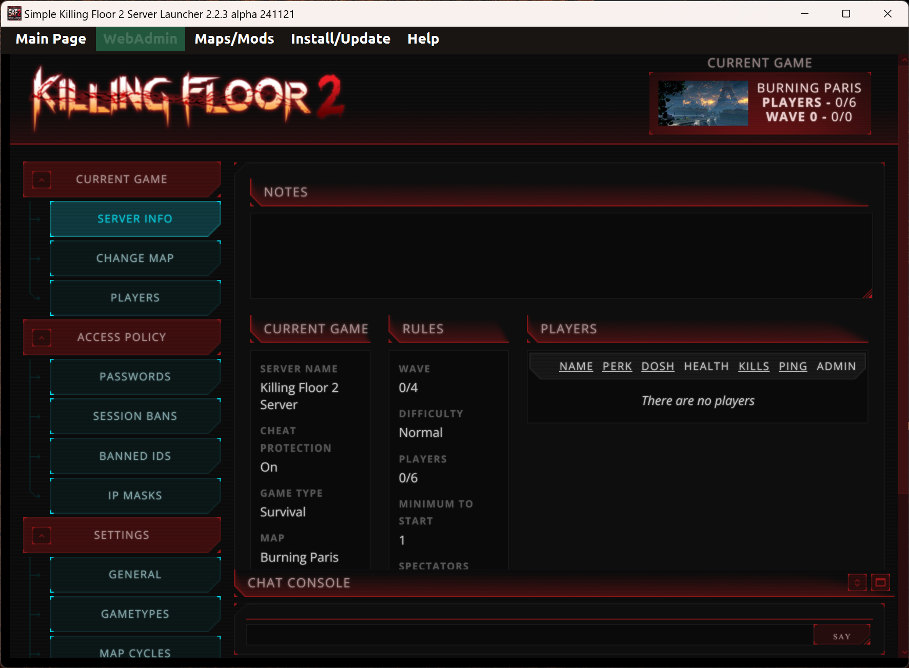

# Basic configuration

## Main page

* _Platform_: This combo is mandatory. It allows to select the platform where the server is installed.
 
* _Profile_: This combo is mandatory. It allows to customize filter values by profile name.

* _Profile's wheel icon_: Link to the page where you can manage Profiles of the server.

* _Run server_: Run a Killing Floor 2 server with the specified filters. All mandatory fields must be specified. Server config files are placed in folder: KFGame/Config/PROFILENAME. So, the original config files placed in folder: KFGame/Config are never modified.
If more than one profile, you can launch multiple servers at once (one per profile).

* _Join server_: Join to a Killing Floor 2 server game previously started. If the server has not been started, the operation will start the game but it will not join to any sever. Pre-requisites: Steam application and Killing Floor 2 game client must be installed.
If more than one profile, you can select wich server you want to join (one per profile).

* _Console_: Link to [console page](#console-page) where you can see executed commands by the launcher.

#### Basic parameters

* _Map_: This combo is mandatory. It allows you to select one specific official map or custom map. *NOTE: Custom maps are visible in this field only if they were already downloaded before*.

* _Map's plus icon_: Link to add maps to the launcher through Steam's workshop page.

* _Map's wheel icon_: Link to Maps/Mods menu where you can manage maps and mods.

* _Language_: This combo is mandatory. It allows to select a language for the launcher's interface. 

* _Game Type_: This combo is mandatory. It allows you to select one specific game type.

* _Game Type's wheel icon_: Link to the page where you can manage Game Types of the server.

* _Difficulty_: This combo is mandatory. It allows you to select one specific difficulty level.

* _Difficulty's wheel icon_: Link to the page where you can manage Difficulties of the server.

* _Length_: This combo is mandatory. It allows you to select one specific number of waves.

* _Length's wheel icon_: Link to the page where you can manage Lengths of the server.

* _Max. players_: This field is mandatory. It allows you to select one specific maximum number of players in a match.

* _Max. players wheel icon_: Link to the page where you can manage Max. Players of the server.

* _Server name_: This field is mandatory. It must contain at least one character.

* _Server password_: This field is optional. It allows you to protect your server with a password (needed to known to be able to join the game).

* _URL image server_: This field is optional. This is a local image uploaded to an embedded http web server. The image resolution must be 512x256 and format PNG. If defined, it will be visible in the welcome screen of the server game but only if "Your clan", "Your web link" and "Welcome message" parameters are defined too.
 
* _Your clan_: This field is optional.

* _Your web link_: This field is optional.

* _Welcome message_: This field is optional. It's a welcome message in starting screen of the server.

* _Web page_: If web page check is enabled you can manage the server through WebAdmin page. Killing Floor 2 server must be launched before you can access WebAdmin page.

* _Web password_: This field is optional. It allows you to protect WebAdmin page with a password to login.

* _Takeover_: If this check is enabled other people can takeover the server, that means, change the password, change other configurations and take the control of the server.

#### Custom Image Server
You can upload a custom image to the embedded http web server to be visible in KF2's server.
Not all the images are supported in the game. Only images that meet image resolution must be 512x256, format PNG and color in 16 bits depth.

#### Advanced parameters

* _Map voting_: This check enables or disables map voting screen after a game ends.

* _Map voting time_: This field is optional. The time, in seconds, you have to vote a map.

* _Kick voting_: This check enables or disables the ability to cast a kick vote.

* _Kick percentage_: This field is optional. How many players it will take to pass a kick vote. Example: 0.50 = 50% is 3/6 players, 0.66 = 66% is 4/6 players, 0.83 = 83% is 5/6 players, etc. Minimum value is 0, maximum is 1.

* _Time between kick votes_: This field is optional. The time, in seconds, you must wait after a kick vote has failed before initiating another kick vote.

* _Max.idle time to be kicked_: This field is optional. Set the maximum time players can idle before getting automatically kicked. Maximum is 300 seconds. Players will be notified via text chat if they're idling too long.

* _Public text chat_: This check enables or disables text chat entirely.

* _Spectators chat_: If this check is enabled, spectators will only be allowed to talk with other spectators. This does not affect text chat.

* _VoIP_: This check enables or disables voice chat entirely.

* _Dead players can talk_: If this check is false, players that die will not be able to voice chat until they spawn back in.

* _Chat logging_: If this check is enabled, the in-game text chat will be logged to a file.

* _Chat logging filename_: This field is optional. It indicates the filename used to log the text chat. You can enable the use of timestamp with the filename. 

* _Team collision_: This check enables or disables players to be able to walk through each other during the game.

* _Admin can pause_: If this check is enabled, it allows admins to pause the game for all players using the console command: pause. If game is paused, players will still be able to connect and join the server.

* _Announce admin login_: if this check is enabled, when you login as admin in-game, it will announce to everyone "PlayerName has logged in as Admin".

* _Ready up delay_: This field is optional. The time, in seconds, you must wait when all players are set to "Ready Up" except one player.    

* _Game start delay_: This field is optional. The delay, in seconds, you wait after all players are set to "Ready Up". Lowest value you can use is 1.

* _Max.spectators_: This field is optional. The maxium numbers of spectators allowed.

* _Map objetives_: If this check is enabled, the stand your ground map objectives are present.

* _Pick up items_: This check enables or disables Kevlar and weapon pick ups.

* _Friendly fire percentage_: This field is optional. Enables players to inflict damage on their teammates. Minimun value is 0, maximum is 1.

* _Ports_: These fields are optional. You need to open ports in your router and firewall. If more than one server is launched, ports must be different between them (one configuration per profile).

* _Tickrate_: These parameters mean how many times the server updates per second. The higher the better. Manimum value admited is 60.

* _Max client rate_: These parameters mean bandwith cap in bytes.

#### Custom parameters

* _Custom parameters_: This field is optional. It defines additional parameters. The format must be: [?]parameter1=value1?parameter2=value2?...?parameterN=valueN

  [?] means: optionally you can start parameters by "?"
  
## WebAdmin page
In this section you can access to WebAdmin page only if the server is already started and web page is checked in "Main Page" section of the application.
WebAdmin allows you to manage and control the Killing Floor 2 server.

## Console page
In this section you can see the commands generated by the launcher when you run or join a server.

---
Back to main page [here](../README.md).