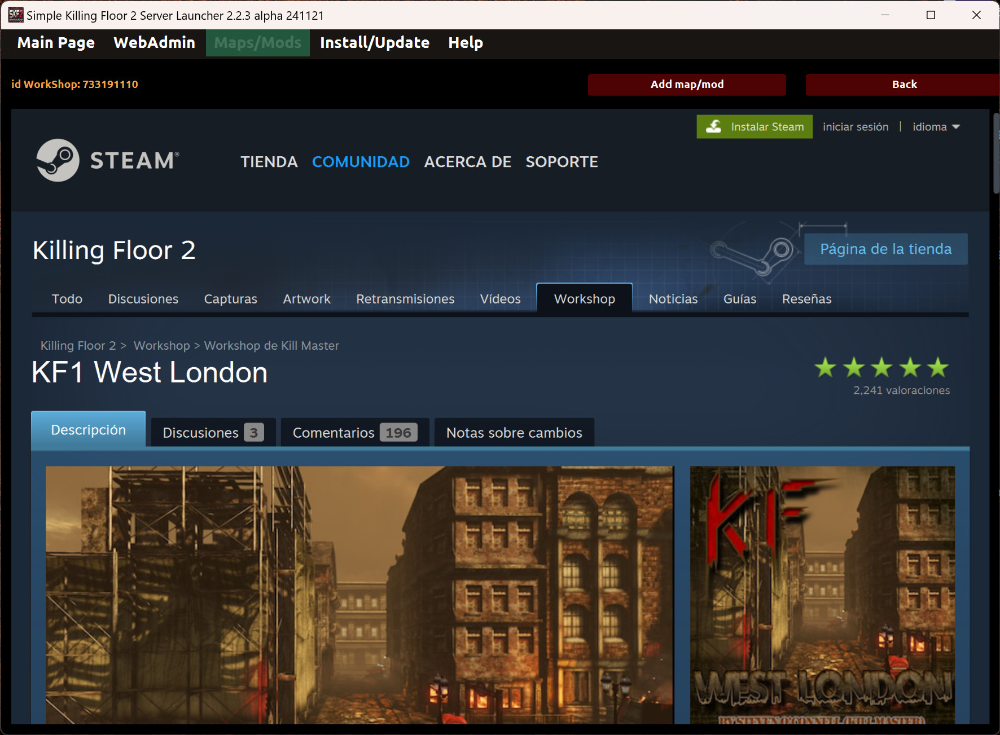

# Custom maps and mods

Under Maps/Mods page you can manage custom maps, mods and official maps present in the server.

* _Profile combo_: It allows to select the actual profile you want to use.

* _Actions menu_: It has several options to manage custom or official maps.
  * _Add new maps by URL/Id WorkShop_: It allows to add new custom maps and mods from Steam's WorkShop by WorkShop's Id or URL. If more than one element, use comma as separator.
  * _Search maps in WorkShop_: It allows to browse in Workshop's pages looking for new maps and mods. Then you can choose wich of them add to the launcher.
  * _Edit selected maps_: It allows to edit all maps and mods previously selected.
  * _Delete selected maps_: It allows to delete all maps and mods previously selected.
  * _Import maps from server_: It allows to import all custom maps, mods and official maps from the server to the launcher. Only the elements not present already in the launcher.
  * _Order maps by alias_: It allows to sort the maps alphabetically by alias (ascendent or descendent).
  * _Order maps by name_: It allows to sort the maps alphabetically by name (ascendent or descendent).
  * _Order maps by release date_: It allows to sort the maps by release date (ascendent or descendent).
  * _Order maps by imported date_: It allows to sort the maps by imported date to the launcher (ascendent or descendent).
  * _Order maps by download_: It allows to sort the maps by download state (ascendent or descendent).

* _Search filter_: It allows to filter maps and mods by name while you are writing the text.

* _Select all_: It allows to select all maps to perform an action over them. Furthermore it allows to unselect them.

* _Columns slider_: It allows to change the thumbnail size of the maps by the specific number of columns.

## Search in WorkShop page

Under WorkShop page you can navigate through map and mod pages to find new ones and add them to the launcher if you want. 

## Edit map page

Under "Edit Map" page you can edit some map information like "alias", "preview image", "release date" and link to the "information page".

---
Back to main page [here](../README.md).