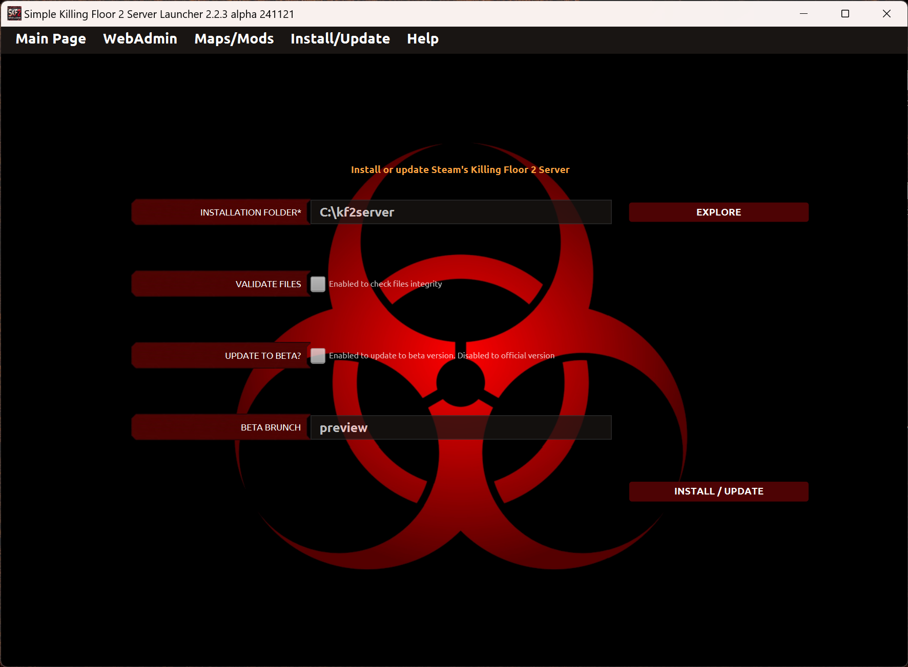

# Install the server

Under Install/Update page you can install or update the Killing Floor 2 server.

* _Installation folder_: This field is mandatory. Needed to find the local folder where the server must be installed.

* _Validate files_: This field is optional. If enabled, the install/update operation checks the integrity of the server's files. Slow operation.

* _Update to beta?_: This field is optional. If enabled, the operation updates to a beta version of the game (if available).

* _Beta brunch_: This field is optional. The user specifies the name of the beta brunch (only used when last check was enabled).

---
Back to main page [here](../README.md).
