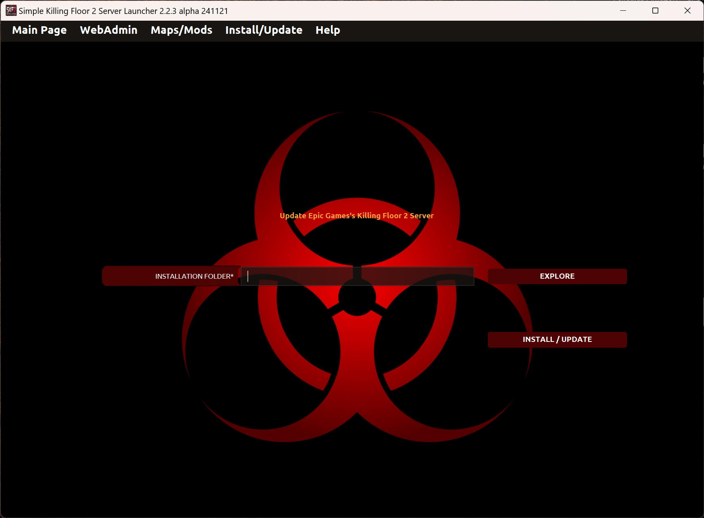

# Install the server

Under Install/Update page you can install or update the Killing Floor 2 server.

## Steam installation

* _Installation folder_: This field is mandatory. Needed to find the local folder where the server must be installed.

* _Validate files_: This field is optional. If enabled, the install/update operation checks the integrity of the server's files. Slow operation.

* _Update to beta?_: This field is optional. If enabled, the operation updates to a beta version of the game (if available).

* _Beta brunch_: This field is optional. The user specifies the name of the beta brunch (only used when last check was enabled).

* _Install/Update button_: To do the install or update operation over the server. Farthermore, in Linux OS, it aplies a patch to be able to downloanload Steam WorkShop's maps.  

## Epic Games installation

Epic Games's server is installed by default when the client is installed in the computer, so, the launcher doesn't install the server but it is used for specify the folder where it is installed.

* _Installation folder_: This field is mandatory. Needed to find the local folder where the server is installed.

* _Install/Update button_: To do the update operation over the server. Farthermore, it aplies a patch to be able to downloanload Steam WorkShop's maps.

---
Back to main page [here](../README.md).
