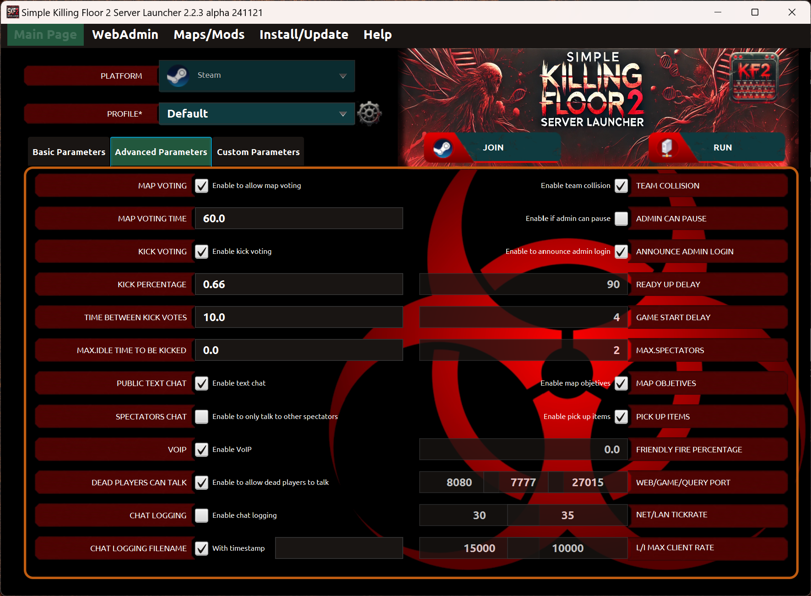

# Configuración básica

## Página principal

* _Plataforma_: Este combo es obligatorio. Permite seleccionar la plataforma donde está instalado el servidor.

* _Perfil_: Este combo es obligatorio. Permite personalizar los valores de los filtros por nombre de perfil.

* _Icono rueda de Perfil_: Enlace a la página donde puedes gestionar Perfiles del servidor.

* _Ejecutar servidor_: Ejecuta un servidor Killing Floor 2 con los filtros especificados. Todos los filtros obligatorios deben ser especificados. Los ficheros de configuración del servidor están ubicados en la carpeta: KFGame/Config/NOMBREPERFIL. De esta manera, los ficheros de configuración originales localizados en la carpeta: KFGame/Config nunca son modificados.
Si hay más de un perfil definido, puedes lanzar múltiples servidores a la vez (uno por perfil). 

* _Unirse al servidor_: Unirse a un servidor de Killing Floor 2 previamente iniciado. Si el servidor no ha sido iniciado, la operación iniciará el juego pero no se unirá a ningún servidor. Pre-requisitos: Deben estar instaladas las aplicaciones: Steam y cliente (juego) Killing Floor 2. 
Si hay más de un perfil definido, puedes seleccionar a qué servidor quieres unirte (uno por perfil).

* _Consola_: Enlace a la [página de la consola](#página-de-la-consola) donde puedes ver los comandos ejecutados por el lanzador.

#### Parametros basicos

* _Mapa_: Este combo es obligatorio. Permite seleccionar un mapa oficial o personalizado específico. *NOTA: Los mapas personalizados son visibles en este campo sólamente si han sido descargados previamente.*

* _Icono más de Mapa_: Enlace para añadir mapas al lanzador a través de la página del workshop de Steam.

* _Icono rueda de Mapa_: Enlace al menú Mapas/Mods donde puedes gestionar los mapas y mods.

* _Idioma_: Este combo es obligatorio. Permite seleccionar un idioma para la interfaz del lanzador.

* _Tipo de juego_: Este combo es obligatorio. Permite seleccionar un tipo de juego específico.

* _Icono rueda de Tipo de juego_: Enlace a la página donde puedes gestionar Tipos de juegos del servidor.

* _Dificultad_: Este combo es obligatorio. Permite seleccionar un nivel de dificultad específico.

* _Icono rueda de Dificultad_: Enlace a la página donde puedes gestionar Dificultades del servidor.

* _Longitud_: Este combo es obligatorio. Permite seleccionar un número específico de oleadas.

* _Icono rueda de Longitud_: Enlace a la página donde puedes gestionar Longitudes del servidor.

* _Máx. jugadores_: Este combo es obligatorio. Permite seleccionar un número máximo de jugadores específico en la partida.

* _Icono rueda de Máx. jugadores_: Enlace a la página donde puedes gestionar Máx. jugadores del servidor.

* _Nombre de servidor_: Este campo es obligatorio. Debe contener al menos un caracter. 

* _Contraseña de servidor_: Este campo es opcional. Permite proteger tu servidor con una contraseña (se necesita conocer para poder unirse al juego).

* _URL imágen servidor_: Este campo es opcional. Esta es una imágen local subida a un servidor web http embebido. La resolución de la imágen debe ser 512x256 y el formato PNG. Si es definido, será visible en la pantalla de bienvenida del servidor pero sólo si los parámetros "Tu clan", "Tu enlace web" y "Mensaje de bienvenida" son definidos también.
  
* _Tu clan_: Este campo es opcional.

* _Tu página web_: Este campo es opcional.

* _Mensaje de bienvenida_: Este campo es opcional. Es un mensaje de bienvenida en la pantalla iniciar del servidor.

* _Página web_: Si el check de página web está activo, puedes gestionar el servidor mediante la página WebAdmin. El servidor de Killing Floor 2 debe haberse lanzado previamente a acceder a la página de WebAdmin.

* _Contraseña web_: Este campo es opcional. Permite proteger la página de WebAdmin con una contraseña para autenticarse.

* _Toma de control_: Si este check está habilitado, otras personas pueden tomar control del servidor, esto es, cambiar la contraseña y otras configuraciones, etc.

#### Imágen de Servidor Personalizada
Puedes subir una imágen personalizada al servidor web http embebido para ser visible en el servidor de KF2.
No todas las imágenes son soportadas por el juego. Sólanente las imágenes que cumplen tener resolución 512x256, formato PNG y profundidad de color en 16 bits.

#### Parámetros avanzados

* _Votación de mapa_: Este check habilita o desabilita la pantalla de votación de mapa después de que el juego finaliza. 

* _Tiempo de votación mapa_: Este campo es opcional. El tiempo, en segundos, que tienes para votar un mapa. 

* _Votación de expulsión_: Este check habilita o deshabilita la posibilidad de votar una expulsión. 

* _Porcentaje de expulsión_: Este campo es opcional. Indica cuántos jugadores tomará para realizar una expulsión. Ejemplo 0.50 = 50% es 3/6 jugadores, 0.66 = 66% es 4/6 jugadores, 0.83 = 83% is 5/6 jugadores, etc. Valor mínimo es 0, máximo es 1.

* _Tiempo entre expulsiones_: Este campo es opcional. El tiempo, en segundos, que debes esperar después de un voto de expulsión fallido y antes de iniciar otro voto. 

* _Tiempo inactivo expulsión_: Este campo es opcional. Establece el tiempo máximo de inactividad de los jugadores antes de que sean expulsados automáticamente. Máximo es 300 segundos. Los jugadores serán notificados mediante chat si están inactivos mucho tiempo.  

* _Chat público_: Este check habilita o deshabilita el chat de texto por completo. 

* _Chat de espectador_: Si este check está activo, los espectadores sólo podrán hablar a otros espectadores. No afecta al chat de texto.

* _VoIP_: Este check habilita o deshabilita el chat de voz por completo. 

* _Muertos pueden hablar_: Si este check está desactivado, los jugadores que mueren no podrán hablar hasta que retornen a la partida.

* _Logs del chat_: Si este check está activado, el chat de texto será registrado en un fichero.

* _Nombre fichero de logs_: Este campo es opcional. Indica el nombre del fichero usado para registrar el chat de texto. Puedes activar el uso de marca de tiempo con el nombre de fichero.

* _Colisión de equipo_: Este check activa o desactiva la colisión de jugadores mientras caminan durante el juego. 

* _Admin puede pausar_: Si este check está activo, permite a los administradores pausar el juego para todos los jugadores mediante el comando: pause. Si el juego está en pausa, los jugadores aún pueden conectarse y unirse al mismo.
 
* _Anunciar entrada Admin_: Si este check está activo, cuando te autenticas como un administrador en el juego, se anunciará a todo el mundo "NombreJugador se ha hecho Admin".

* _Tiempo espera preparados_: Este campo es opcional. Indica el tiempo, en segundos, que debes esperar cuando todos los jugadores están preparados excepto uno.

* _Tiempo espera comienzo_: Este campo es opcional. Indica el tiempo de espera, en segundos, que debes esperar cuando todos los jugadores están preparados. El valor mínimo es 1. 

* _Max.espectadores_: Este campo es opcional. Indica el máximo número de espectadores permitidos.

* _Objetivos de mapa_: Si este check está activo, estarán presentes los objetivos del mapa.

* _Recoger artículos_: Este check activa o desactiva la recogida de armadura Kevlar y armas.

* _Porcentaje fuego amigo_: Este campo es opcional. Permite a los jugadores infligir fuego amigo a otros miembros del equipo. El valor mínimo es 0, máximo es 1.

* _Puertos_: Los puertos son opcionales. Necesitas abrir los puertos en tu router y firewall. Si se lanza más de un servidor, los puertos deben ser diferentes entre ellos (una configuración por perfil).

* _Tickrate_: Estos parámetros significan cuántas veces el servidor actualiza por segundo. Mayor valor es mejor. El valor máximo permitido es 60.

* _Max client rate_: Estos parámetros significan límite de ancho de banda en bytes.

#### Parámetros personalizados

* _Parámetros personalizados_: Este campo es opcional. Define parámetros adicionales. El formato debe ser: [?]parametro1=valor1?parametror2=valor2?...?parametroN=valorN

  [?] significa: opcionalmente puedes comenzar los parámetros por "?"

## Página WebAdmin
En esta sección puedes acceder a la página WebAdmin sólamente si el servidor ya está iniciado y la página web está activa en la sección "Página Principal" de la aplicación.
WebAdmin te permite gestionar y controlar el servidor de Killing Floor 2.

## Página de la consola
En esta sección puedes ver los comandos generados por el lanzador cuando ejecutas o te unes a un servidor.

---
Back to main page [here](../../LEEME.md).