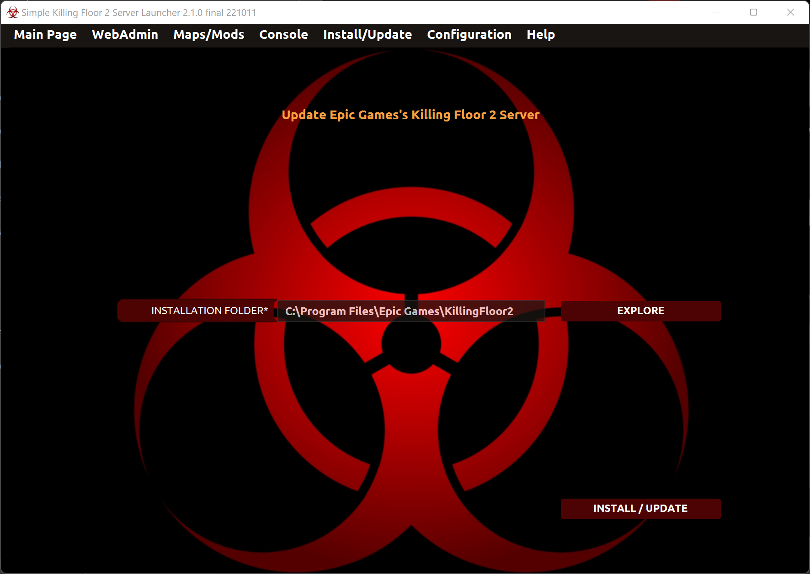

# Instalar el servidor

En la página de Instalar/Actualizar puedes instalar o actualizar el servidor de Killing Floor 2.

## Instalación de Steam

* _Carpeta de instalación_: Este campo es obligatorio. Necesario para encontrar la carpeta local donde el servidor debe ser instalado.

* _Validar ficheros_: Este campo es opcional. Si está activado, la operación de instalar/actualizar revisa la integridad de los ficheros del servidor. Es una operación lenta.

* _¿Actualizar a beta?_: Este campo es opcional. Si está activado, la operación actualiza a una versión beta del juego (si estuviera disponible).

* _Rama beta_: Este campo es opcional. El usuario especifica el nombre de la rama beta (sólamente usado cuando el check anterior ha sido activado).

* _Botón de instalar/Actualizar_: Hace la operación de instalar o actualizar el servidor. Además, en el SO Linux, aplica un parche para poder descargar mapas de Steam WorkShop.

## Instalación de Epic Games

El servidor de Epic Games es instalado por defecto cuando el cliente es instalado en el ordenador, así que, el lanzador no instala el servidor sino que es usado para especificar la carpeta donde está instalado.

* _Carpeta de instalación_: Este campo es obligatorio. Necesario para encontrar la carpeta local donde el servidor está instalado.

* _Botón de instalar/Actualizar_: Hace la operación de instalar o actualizar el servidor. Además, aplica un parche para poder descargar mapas de Steam WorkShop.

---
Back to main page [here](../../LEEME.md).