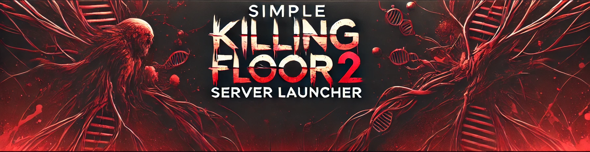
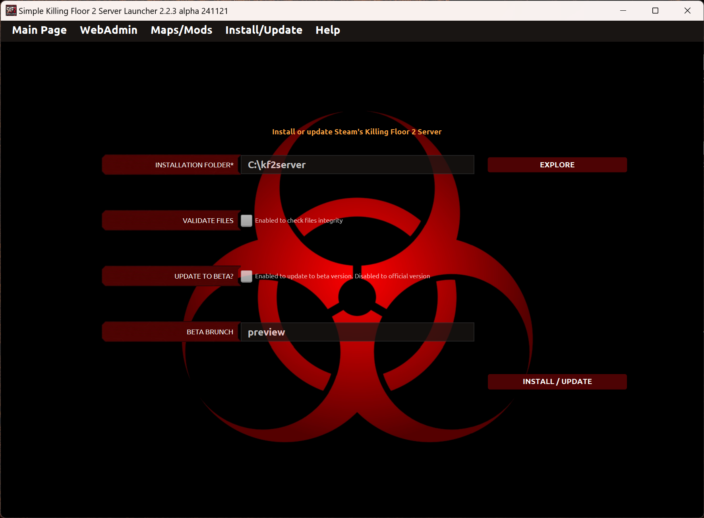

# Instalar el servidor

En la página de Instalar/Actualizar puedes instalar o actualizar el servidor de Killing Floor 2.

* _Carpeta de instalación_: Este campo es obligatorio. Necesario para encontrar la carpeta local donde el servidor debe ser instalado.

* _Validar ficheros_: Este campo es opcional. Si está activado, la operación de instalar/actualizar revisa la integridad de los ficheros del servidor. Es una operación lenta.

* _¿Actualizar a beta?_: Este campo es opcional. Si está activado, la operación actualiza a una versión beta del juego (si estuviera disponible).

* _Rama beta_: Este campo es opcional. El usuario especifica el nombre de la rama beta (sólamente usado cuando el check anterior ha sido activado).

---
Back to main page [here](../../LEEME.md).