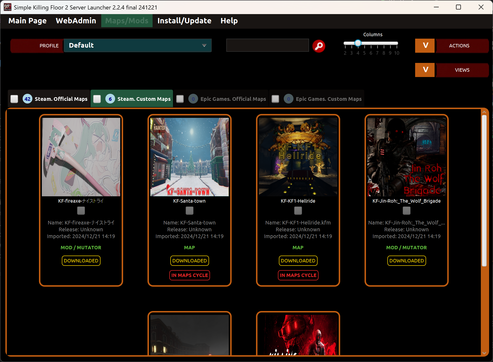

# Mapas personalizados y mods

En la página Mapas/Mods puedes gestionar mapas personalizados, mods y mapas oficiales presentes en el servidor.

* _Combo de perfiles_: Permite seleccionar el perfil actual a usar.

* _Menú acciones_: Tiene varias opciones para manejar mapas personalizados y oficiales.
  * _Añadir nuevos mapas por URL/Id WorkShop_: Permite añadir nuevos mapas personalizados y mods desde el WorkShop de Steam mediante id de WorkShop o URL. Si hay más de un elemento, usa comas como separador.
  * _Buscar mapas en WorkShop_: Permite navegar en las páginas de WorkShop buscando nuevos mapas y mods. Luego puedes seleccionar cuál de ellos añadir al lanzador.
  * _Descargar mapas seleccionados_: Permite descargar todos los mapas y mods previamente seleccionados.
  * _Editar los mapas seleccionados_: Permite editar todos los mapas y mods previamente seleccionados.
  * _Elimina los mapas seleccionados_: Permite eliminar todos los mapas y mods previamente seleccionados.
  * _Importa mapas del servidor_: Permite importar todos los mapas personalizados, mods y mapas oficiales del servidor al lanzador. Sólamente los elementos que no está aún presentes en el lanzador.
  * _Añadir mapas seleccionados al ciclo de mapas_: Permite añadir todos los mapas oficiales/personalizados seleccionados a la lista de votos mostrado al final de cada partida dentro del juego.
  * _Eliminar mapas seleccionados del ciclo de mapas_: Permite eliminar todos los mapas oficiales/personalizados seleccionados de la lista de votos mostrado al final de cada partida dentro del juego.
  * _Ordenar mapas por alias_: Permite ordenar los mapas alfabéticamente por alias (ascendente o descendente).
  * _Ordenar mapas por nombre_: Permite ordenar los mapas alfabéticamente por nombre (ascendente o descendente).
  * _Ordenar mapas por fecha de lanzamiento_: Permite ordenar los mapas por fecha de lanzamiento (ascendente or descendente).
  * _Ordenar mapas por fecha de importación_: Permite ordenar los mapas por fecha de importación al lanzador (ascendente or descendente).
  * _Ordenar mapas por descarga_: Permite ordenar los mapas por estado de descarga (ascendente or descendente).
  * _Ordenar mapas por ciclo de mapas_: Permite ordenar los mapas por estado "en ciclo de mapas" (ascendente or descendente).

* _Filtro buscador_: Permite filtrar mapas y mods por nombre mientras vas escribiendo el texto. 

* _Selecciona todos por pestaña_: Permite seleccionar todos los mapas para realizar una acción sobre ellos. Además permite deseleccionarlos.

* _Barra de columnas_: Permite cambiar el tamaño de las miniaturas de los mapas según un número de columnas determinado. 

## Página de búsqueda en WorkShop

En la página de WorkShop puedes navegar a través de páginas de mapas y mods para encontrar nuevos y añadirlos al lanzador si así lo deseas.

## Página de editar mapa

En la página de "Editar mapa" puedes editar parte de la información como "alias", "imágen de previsualización", "fecha de lanzamiento" y enlace a la "página de información".

---
Back to main page [here](../../LEEME.md).