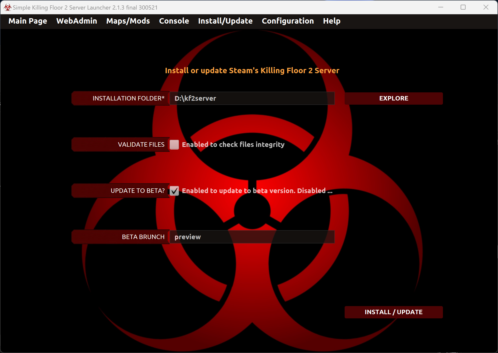
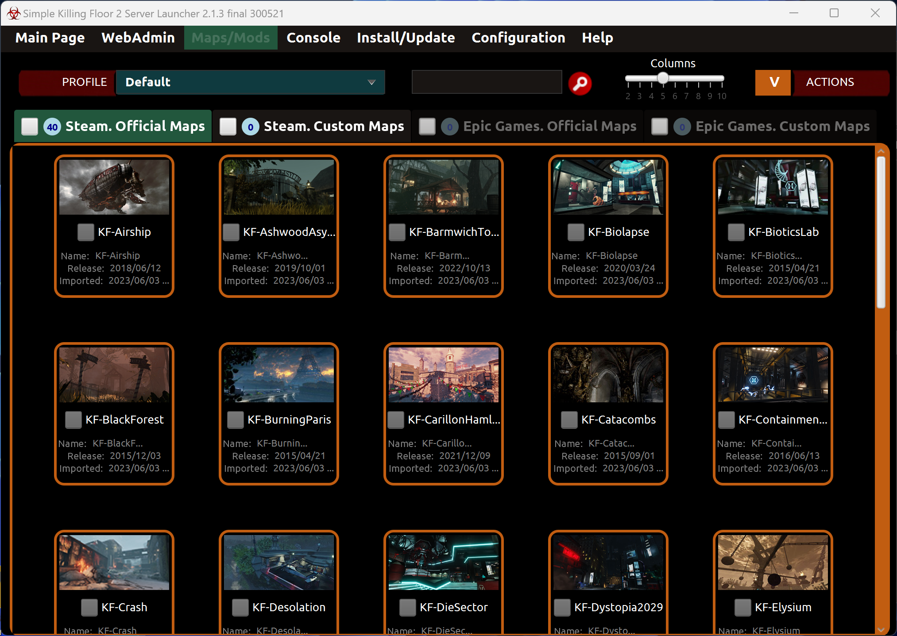
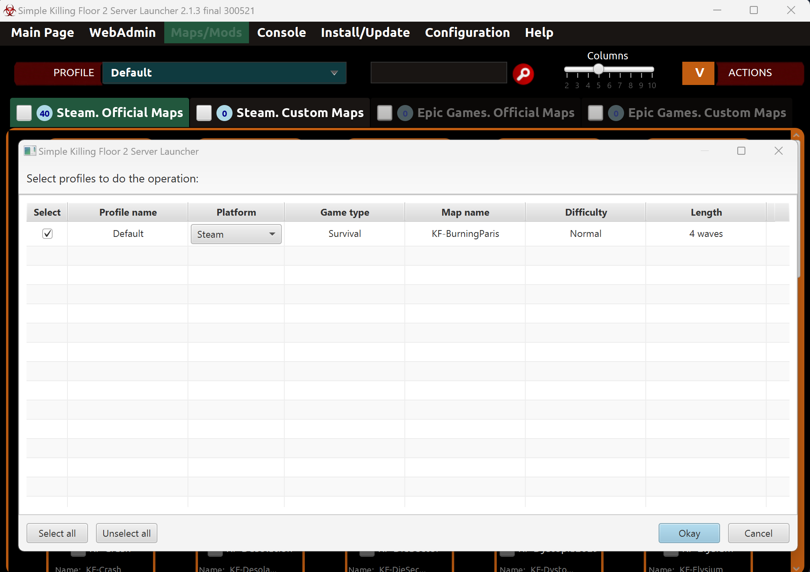
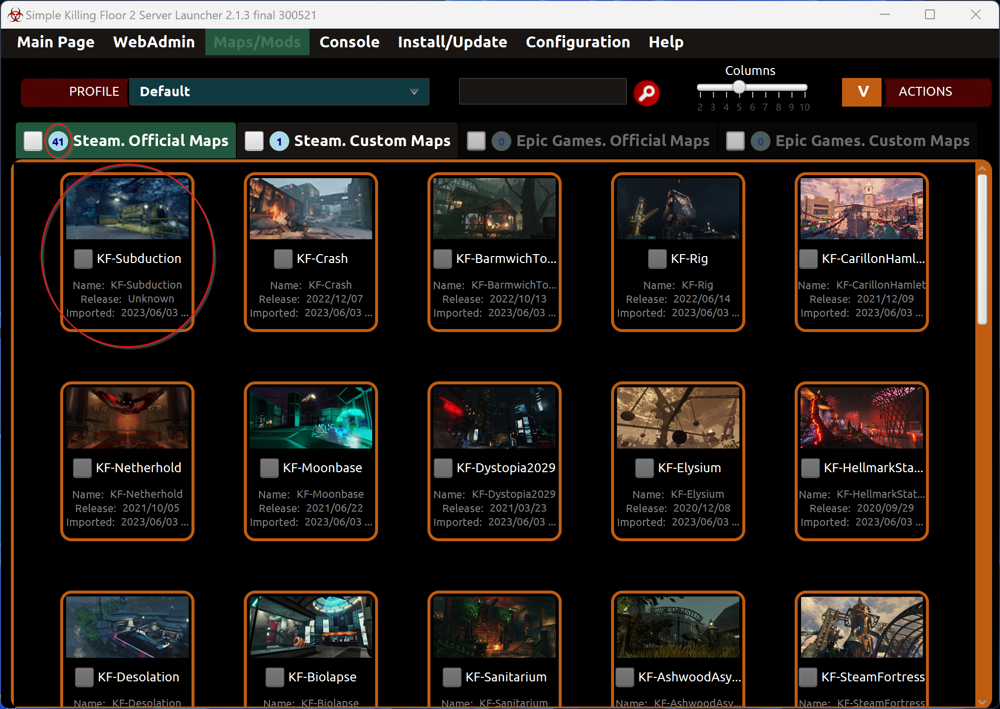

# Consejo 230603#01

Puedes agregar al lanzador los últimos mapas oficiales siguiendo los siguientes pasos:

## Actualizar el servidor KF2
Debes actualizar la instalación del servidor a la última versión oficial o beta para poder descargar los últimos mapas al servidor.

Por ejemplo, actualiza el servidor a la última versión beta:

## Agregar los nuevos mapas de servidor al lanzador
Después de que la actualización se haya completado, los nuevos mapas se han añadido al servidor pero no al lanzador aún.

Para añadirlos al lanzador debes ejecutar la acción "Importar mapas del servidor" en el menú "Mapas/Mods".

Después de que se haya completado la operación, podrás ver que el nuevo mapa está en el lanzador y que se ha incrementado el número de mapas oficiales.

---

Puedes contactar con migo a través de Github:

[https://github.com/cesar-rgon/simple-kf2-server-launcher/issues](https://github.com/cesar-rgon/simple-kf2-server-launcher/issues)

o, directamente, por email:

[cesar.rgon@gmail.com](mailto:cesar.rgon@gmail.com)

¡Hagamos que sea una mejor aplicación!