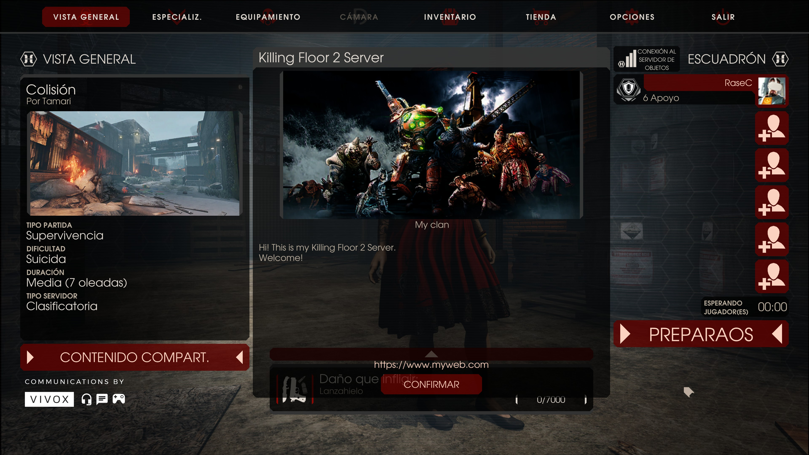
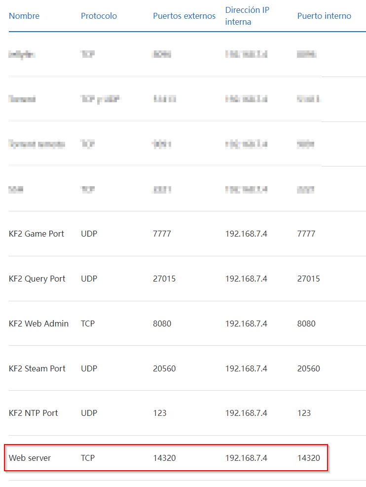
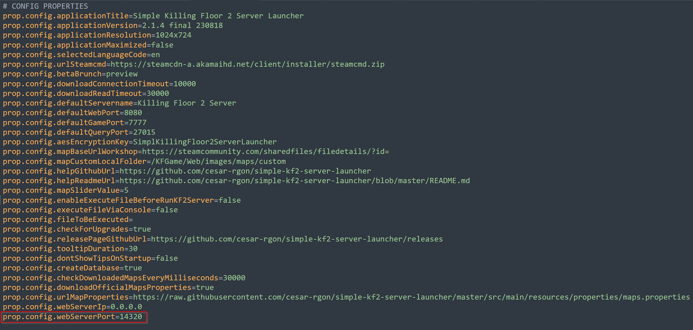

# Pointe 230819#01

Vous pouvez sélectionner des images personnalisées dans le lanceur pour qu'elles soient visibles dans le hall lorsque vous rejoignez votre serveur.

*Un exemple*

*Dans le lobby du jeu*

Afin de travailler des images personnalisées dans le lanceur et le serveur de KF2, vous devez ouvrir le port du serveur Web du lanceur dans votre routeur (par défaut : 14320).

*Un exemple de ports ouverts dans le routeur*

Dans cet exemple, nous supposons que l'adresse IP locale du serveur de KF2 est 192.168.7.4

De plus, vous pouvez modifier le port du serveur Web, si vous le souhaitez, en éditant le fichier "properties/config.properties" et en recherchant l'attribut "prop.config.webServerPort".

---

Si vous avez des suggestions, des propositions d'améliorations ou souhaitez signaler un bug

vous pouvez rejoindre le serveur Discord:

https://discord.gg/WdwRU522Fb

ou contactez-moi via Github:

[https://github.com/cesar-rgon/simple-kf2-server-launcher/issues](https://github.com/cesar-rgon/simple-kf2-server-launcher/issues)

ou, directement, mon email :

[cesar.rgon@gmail.com](mailto:cesar.rgon@gmail.com)

Faisons-en une meilleure application!